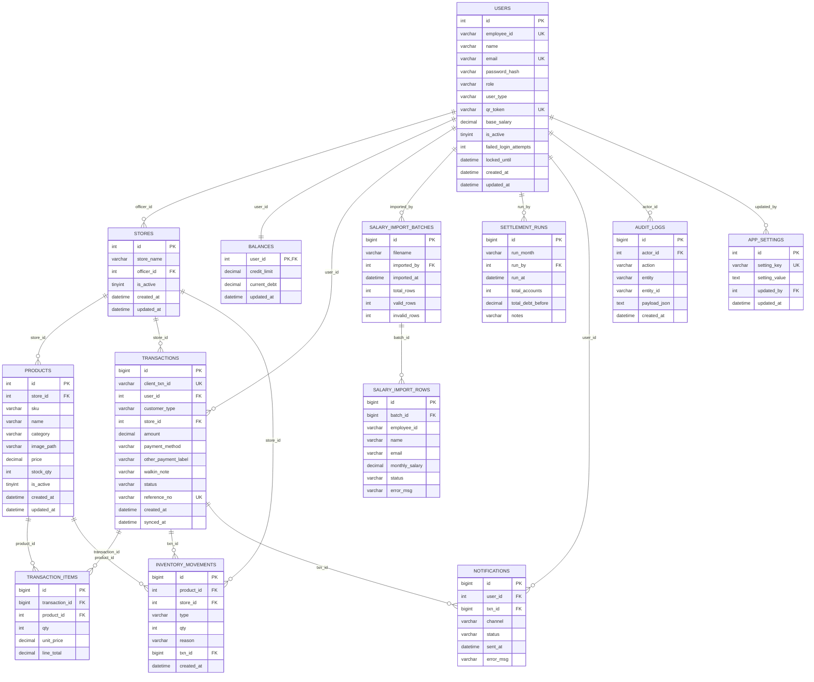

# IBEMS Entity Relationship Diagram

## Notes

- `products` has a composite unique key on `store_id` and `sku`.
- `transactions.user_id` is nullable for walk-in customers.
- `stores.officer_id`, `transactions.user_id`, `salary_import_batches.imported_by`, `settlement_runs.run_by`, `notifications.user_id`, `notifications.txn_id`, `audit_logs.actor_id`, and `app_settings.updated_by` are nullable and use `SET NULL` on delete.
- `balances.user_id` is both the primary key and a foreign key to `users.id`, making it a one-to-one account balance record.
