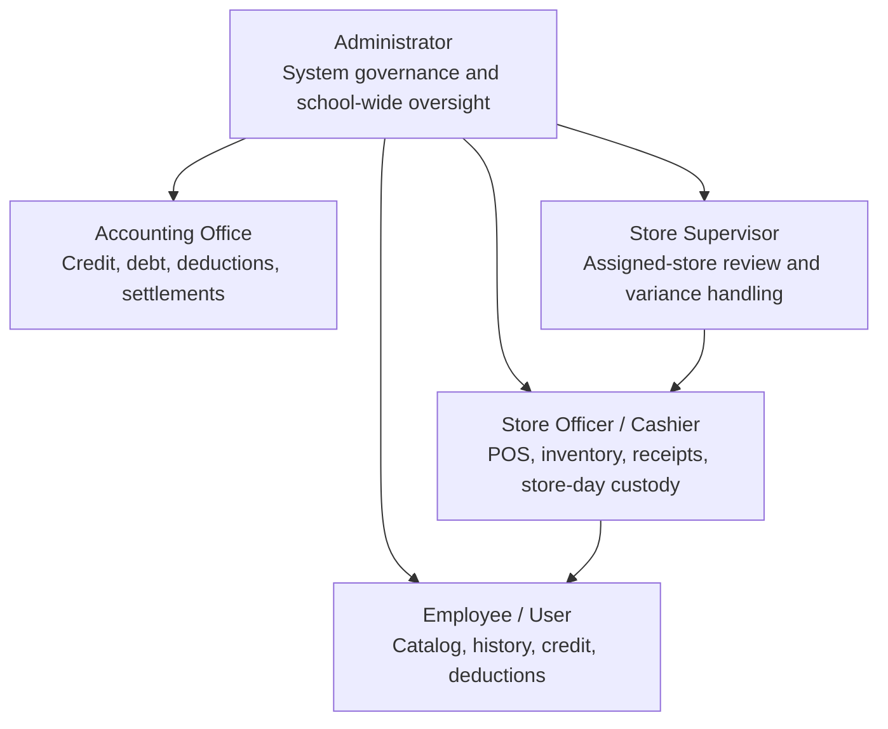
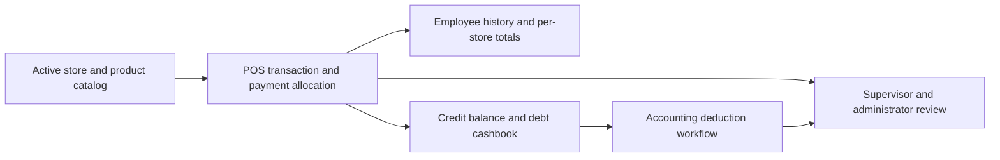

# IBEMS System Hierarchy

This hierarchy is the reference for portal responsibilities, system diagrams, and future workflow discussions.

## Connected transaction flow

## Responsibility rules

- Administrator: users, stores, products, school-wide operations, and audit records.
- Accounting Office: employee financial profiles, credit balances, deductions, settlements, and debt investigations.
- Store Supervisor: assigned-store review, store-day variances, supporting evidence, and handoffs.
- Store Officer / Cashier: POS transactions, products, inventory, receipts, repayments, and store-day custody.
- Employee / User: active store catalog, personal transactions, receipts, credit status, and deduction history.

The active role controls authorization. Older transactions and inactive-store names remain readable for historical integrity.
